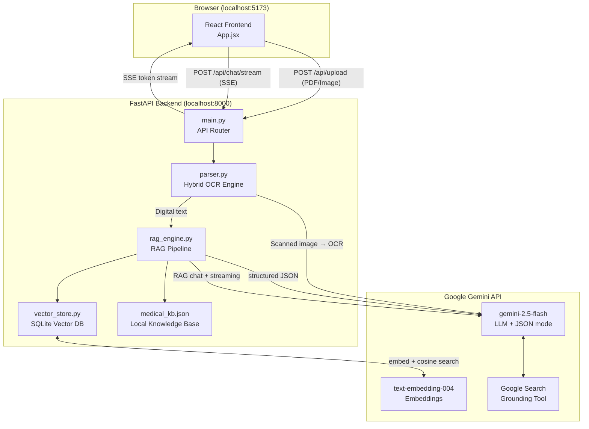
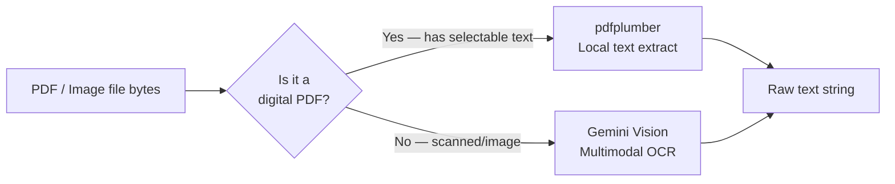
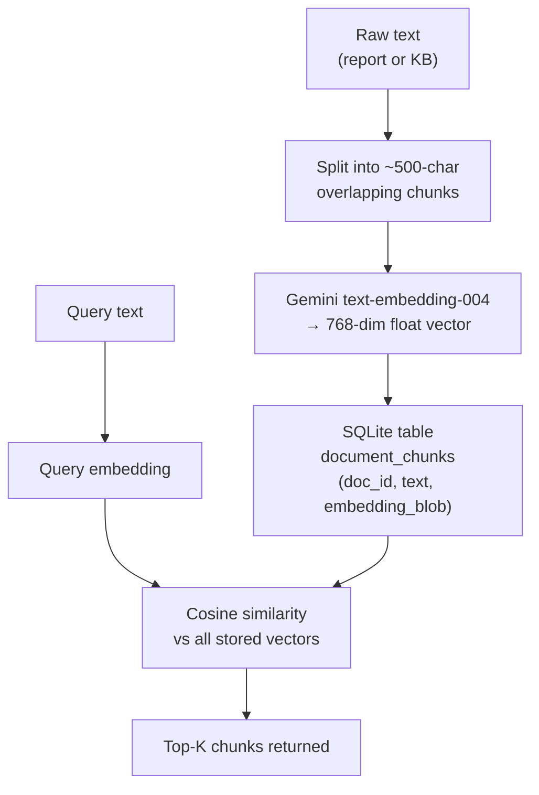
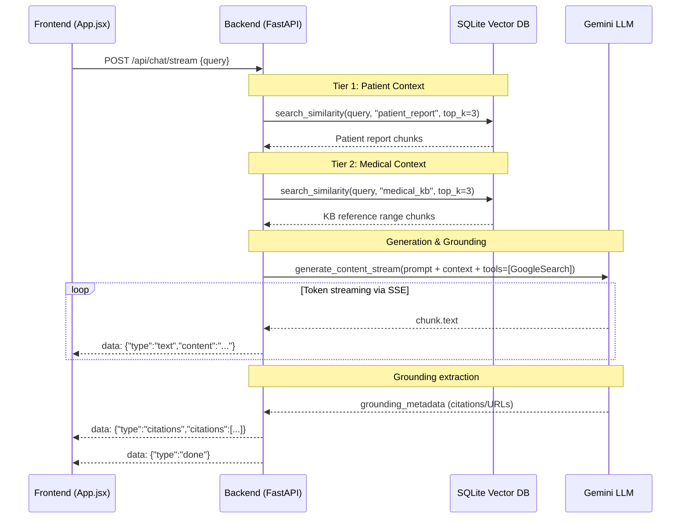

# PathoInsight — System Architecture

This document outlines the technical architecture, data flow, and RAG pipeline for the PathoInsight application.

---

## 1. High-Level System Architecture

The system is decoupled into a frontend React client and a backend FastAPI service. All AI operations (LLM, embeddings, OCR) are offloaded to the Google Gemini API.



---

## 2. Hybrid Document Parser (`parser.py`)

To optimize for both speed and cost, the parser dynamically determines how to extract text from user uploads.


*   **Digital PDFs**: Extracted locally. Zero API cost, nearly instant.
*   **Scanned Images/PDFs**: Fallback to Gemini Vision multimodal prompting to read text from pixels.

---

## 3. Vector Database & Storage (`vector_store.py`)

Instead of using a heavy external vector database (like Pinecone or Milvus), PathoInsight uses a lightweight, self-contained SQLite implementation.


Embeddings are serialized into binary blobs. Similarity search is executed in memory using `numpy` cosine distance calculations, which is highly performant for individual medical records.

---

## 4. The Two-Tier RAG Pipeline (`rag_engine.py`)

When a user asks a question, the system performs a Two-Tier Retrieval Augmented Generation sequence. It fetches context from *both* the patient's specific report and the general medical knowledge base.



### Prompt Structure
The final prompt sent to the LLM looks like this:
```text
System: You are an empathetic medical AI. Never diagnose. Always disclaim.

Context 1 — Patient's Report:
[top 3 semantically similar chunks from the uploaded report]

Context 2 — Clinical Guidelines:
[top 3 semantically similar chunks from medical_kb.json]

Patient Question:
[user's query]
```

---

## 5. Google Search Grounding

To ensure the AI provides up-to-date information (e.g., the latest clinical guidelines for managing elevated LDL cholesterol), the LLM is initialized with `tools=[Tool(google_search=GoogleSearch())]`. 

If the model detects that the user's query requires external, current knowledge, it autonomously executes a Google Search, ingests the top results into its context window mid-generation, and returns the source URLs in the `grounding_metadata` block. The backend parses this block and streams it to the frontend to render clickable source citations.
