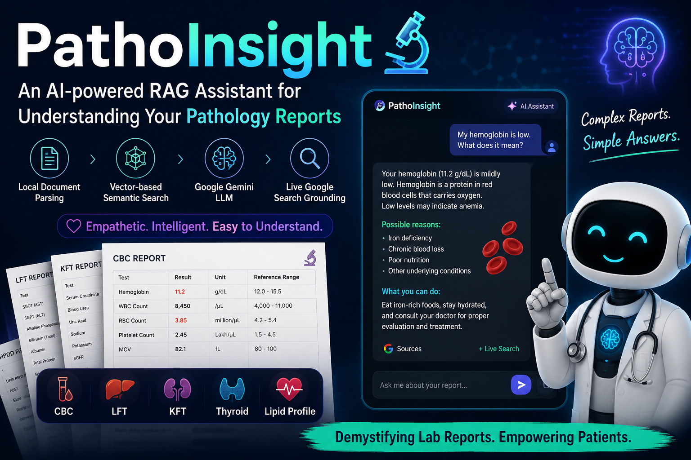
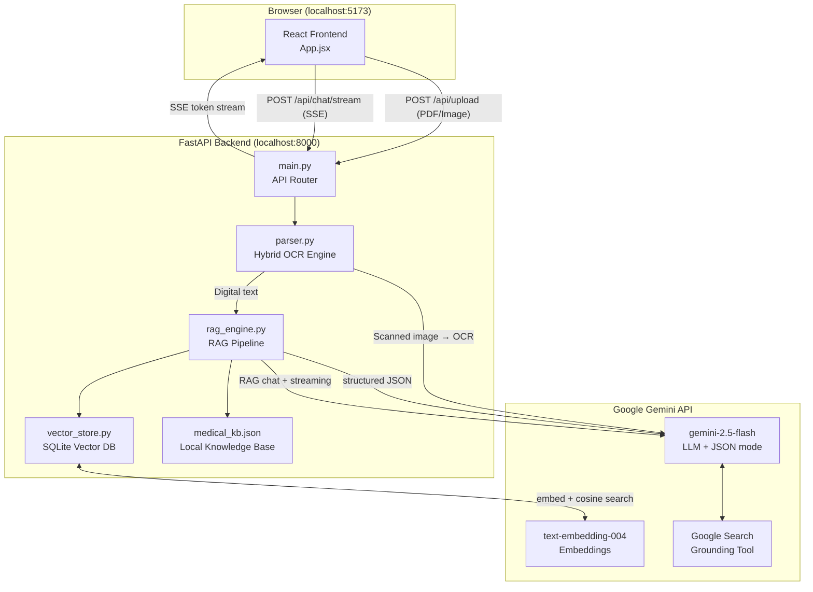

# PathoInsight 🔬

> **An AI-powered Retrieval-Augmented Generation (RAG) assistant for demystifying pathology reports.**

PathoInsight helps patients understand their lab reports (CBC, LFT, KFT, Thyroid, Lipid profiles) by combining local document parsing, vector-based semantic search, and Google Gemini's advanced LLM with live Google Search grounding. It provides an empathetic, knowledgeable medical AI assistant that explains complex medical terminology in plain language.


---

## ⚠️ Medical Disclaimer

**PathoInsight is strictly an educational tool and does not provide medical advice, diagnosis, or treatment.** 

The AI-generated insights, summaries, and explanations are for informational purposes only. Do not disregard professional medical advice or delay seeking it because of information provided by this application. 

**Always consult a qualified physician or healthcare provider for clinical decisions regarding your test results.**

---

## 💡 The Concept & Idea

Medical reports are often filled with complex terminology, abbreviations, and numerical values that can be overwhelming. PathoInsight bridges this gap by:

1. **Extracting** structured data from raw pathology reports (PDFs or images).
2. **Contextualizing** the results against a built-in medical knowledge base covering 5 major panels (CBC, LFT, KFT, Thyroid Profile, Lipid Profile).
3. **Explaining** the findings in plain, empathetic language via an interactive chat interface.
4. **Grounding** its answers using live Google Search to ensure responses reflect current medical guidelines and literature.

**The Goal:** Empower patients to have more informed and meaningful conversations with their doctors.

---

## ✨ Key Features

*   **Hybrid Parsing Engine**: Automatically detects if a PDF has a text layer. Uses fast, free, local parsing (`pdfplumber`) for digital PDFs, and gracefully falls back to multimodal OCR (Gemini Vision) for scanned images or non-searchable PDFs.
*   **Two-Tier RAG Context**: Chat responses are informed simultaneously by the specific patient data (from the uploaded report) and general reference guidelines (from the local KB).
*   **Live Web Grounding**: The LLM isn't limited to training cutoffs. The AI fetches the latest clinical guidelines via Google Search mid-response and provides clickable citations.
*   **Server-Sent Events (SSE) Streaming**: Chat responses stream into the UI token-by-token for a fast, responsive, "typing" experience.
*   **Dynamic UI Suggestions**: Chat suggestion pills are generated at runtime based specifically on the *abnormal* metrics found in the uploaded report.
*   **Compact Table Dashboard**: Clean, scannable layout mimicking real lab reports for easy reading, designed in a custom Light Mode CSS system.

---

## 🏗️ Architecture

PathoInsight is built with a modern, decoupled architecture designed for speed, low overhead, and accurate AI responses.

> **For a deep dive into the data flow and RAG pipeline, read the full [ARCHITECTURE.md](file:///C:/Users/wycli/.gemini/antigravity/scratch/pathology-rag-bot/ARCHITECTURE.md).**

### System Diagram



### Component Breakdown

1. **Parser (`parser.py`)**: 
   ```mermaid
   flowchart LR
       INPUT["PDF / Image"] --> CHECK{"Digital Text?"}
       CHECK -->|"Yes"| LOCAL["pdfplumber"]
       CHECK -->|"No"| OCR["Gemini Vision OCR"]
       LOCAL --> OUT["Raw Text"]
       OCR --> OUT
   ```
2. **Vector Store (`vector_store.py`)**: A lightweight SQLite database storing text chunks and their 768-dimensional float embeddings as binary blobs. Searching is done via fast numpy-based cosine similarity.
3. **RAG Engine (`rag_engine.py`)**: The orchestrator. It handles chunking documents, querying the vector store for both patient context and medical context, and constructing the grounded prompt for Gemini.

---

## 🛠️ Technology Stack

| Domain | Technology | Reason |
| :--- | :--- | :--- |
| **Frontend** | React, Vite, Vanilla CSS | Fast HMR, lightweight, responsive UI. |
| **Backend** | Python, FastAPI, Uvicorn | High performance async Python framework. |
| **LLM & Vision** | Google Gemini (`gemini-2.5-flash`) | Fast, supports JSON schema, multimodal OCR, and Grounding tools. |
| **Embeddings** | Google Gemini (`text-embedding-004`) | High quality 768-dimensional semantic embeddings. |
| **Vector DB** | SQLite + NumPy | Zero-dependency, self-contained, no external infrastructure needed. |
| **PDF Extraction**| `pdfplumber` | Best-in-class local text extraction for digital PDFs. |

---

## 🚀 Setup & Installation

### Prerequisites
*   Node.js (v18+)
*   Python (3.10+)
*   A Google Gemini API Key

### 1. Backend Setup

```bash
cd backend
python -m venv venv

# Activate virtual environment
# On Windows:
.\venv\Scripts\activate
# On Mac/Linux:
source venv/bin/activate

# Install dependencies
pip install fastapi uvicorn google-genai pdfplumber numpy

# Set your API Key
# On Windows:
set GEMINI_API_KEY=your_api_key_here
# On Mac/Linux:
export GEMINI_API_KEY=your_api_key_here

# Run the server
uvicorn main:app --host 127.0.0.1 --port 8000 --reload
```
The backend will run at `http://localhost:8000`.

### 2. Frontend Setup

Open a new terminal window:

```bash
cd frontend

# Install dependencies
npm install

# Run the Vite development server
npm run dev
```
The frontend will run at `http://localhost:5173` (or the next available port).

---

## 📖 Usage Guide

1. **Load a Report**: Open the web app. You can either drag-and-drop a PDF/image of a pathology report, or click **"Load 5-Panel Demo"** to see a pre-populated example featuring mock patient data.
2. **Review the Dashboard**: The left panel will populate with extracted metrics organized by categories (e.g., CBC, LFT), highlighting normal vs. abnormal results.
3. **Ask Questions**: Use the chat panel on the right. If the report has abnormal values, dynamic suggestion pills will appear (e.g., *"Why is my ALT high?"*). Click them or type your own question.
4. **Read Citations**: When the bot responds, it may fetch live data from the internet. Click the "Sources" links below the message to read the original medical articles.
